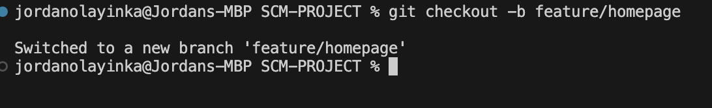

## Task 2: Git Workflow – Feature Branching and Merging

This task involved simulating a basic Git workflow using branches. I initialized a Git repository, created a feature branch, made a change, committed it, then merged the change back into the main branch.

---

### Step 1: Initialize Git Repository  

*Git repository initialized.*

---

### Step 2: Create Feature Branch 
 
*Created the `feature/homepage` branch.*

---

### Step 3: Create and Add Index File  

*Created `index.html` and staged it for commit.*

---

### Step 4: Commit Changes  

*Committed the changes made in `index.html`.*

---

### Step 5: Create Main Branch  
  
*Created and switched to the `main` branch.*

---

### Step 6: Merge Feature Branch  
  
*Merged `feature/homepage` into `main`.*
