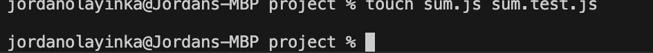
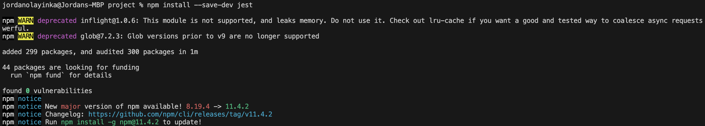
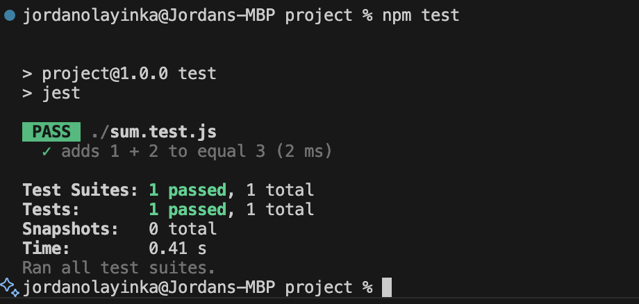
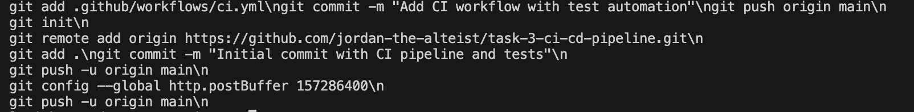
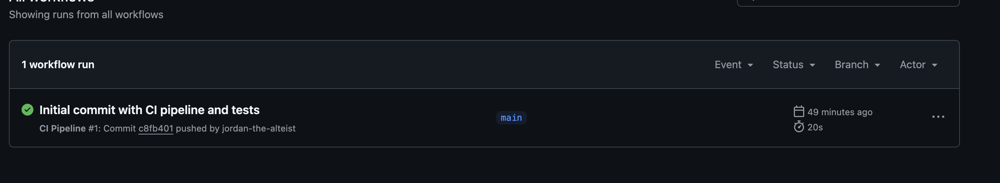

# CI/CD Pipeline Setup with GitHub Actions – What I Did

## 01. I set up a Node.js project  

---

## 02. I created a simple function and a test  

---

## 03. I installed Jest for testing  

---

## 04. I ran the test  

---

## 05. I initialized Git, connected to GitHub, committed, pushed, and fixed a push error  

---

## 06. I verified the CI pipeline  

---

## Final Result  
My repository now runs tests automatically on every push to `main`.

---

## What I Learned  
- How to set up a Node.js project  
- How to write and run automated tests with Jest  
- How to initialize a Git repo and connect it to GitHub  
- How to resolve push errors and confirm CI is working on GitHub