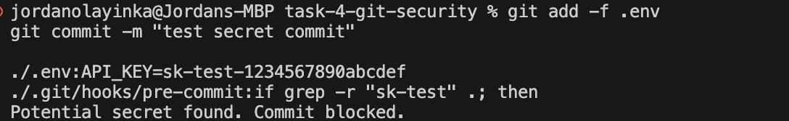

# Git Security Best Practices – What I Did

## 01. I initialized the Git repository  

---

## 02. I created a `.gitignore` file to ignore sensitive files like `.env`  

---

## 03. I confirmed that `.env` was successfully ignored by Git  

---

## 04. I created a `pre-commit` hook to block secrets (like `sk-test`)  
Then I tried committing a secret, and Git **blocked** the commit  

---

## 05. I removed the secret and made a clean commit  

---

## 06. I pushed the code to GitHub successfully  

---

## Final Result  
- Sensitive files like `.env` are ignored  
- Pre-commit hook blocks secret keys like `sk-test`  
- Clean commits are allowed and pushed to GitHub safely

---

