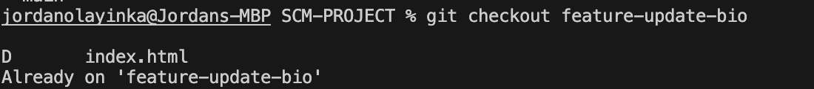

# Git Merge Conflict Resolution – What I Did

## 01. Tried to create a new branch but it already exists  

---

## 02. Edited the `bio.txt` file in the feature branch and committed changes  

---

## 03. Checked current branches and confirmed on feature branch  

---

## 04. Switched between branches `feature-update-bio` and `main`  

---

## 05. Edited and committed `bio.txt` on the main branch  

---

## 06. Merged `feature-update-bio` into `main`, got merge conflict  

---

## 07. Resolved the conflict in `bio.txt`, added and committed the fix  

---
